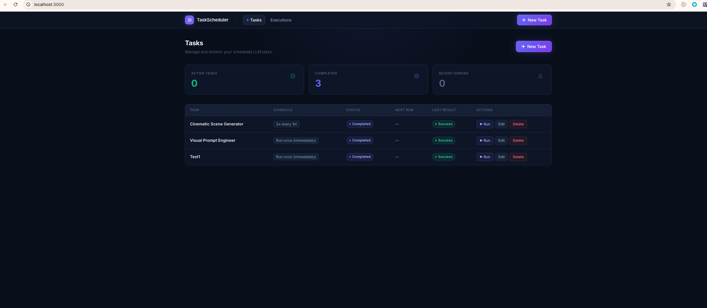
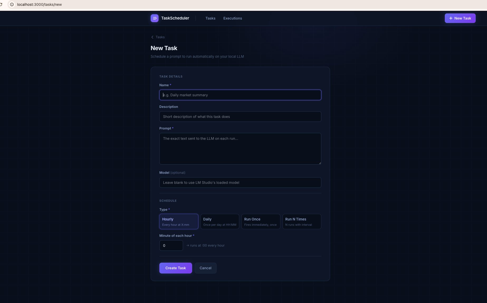
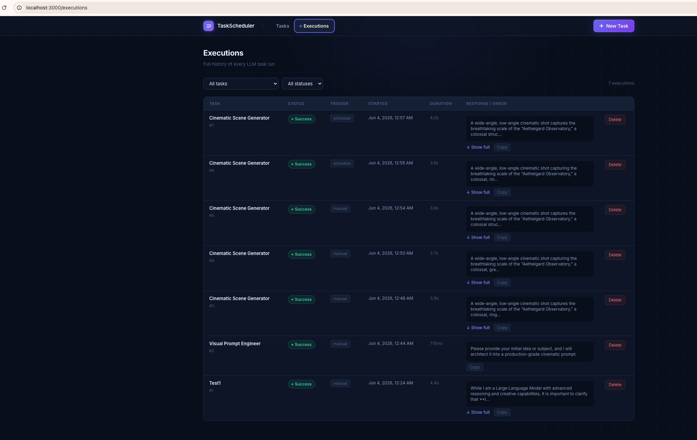

# llm-scheduler

A self-hosted web app for scheduling prompts against a local LLM. Define tasks, attach a schedule, and let the app call your [LM Studio](https://lmstudio.ai) instance automatically — storing every response for review.

No cloud. No subscriptions. Runs entirely on your machine.

---

## Screenshots


*Dashboard — task list with stats, status badges, and quick actions*


*Create task — schedule type selector with conditional fields*


*Execution log — filterable history with expandable LLM responses*

---

## Features

- **4 schedule types** — hourly, daily, run-once, or run N times with a fixed interval
- **Automatic execution** — a single cron tick fires every minute and runs all due tasks
- **Manual run anytime** — trigger any task on demand, regardless of its schedule state
- **Run-time input** — optionally let a task accept one-off extra context at manual run time, layered on top of its base prompt without editing the task
- **Categories** — organize tasks into Production / Experimental / Private, filter by category from the navbar, and keep Private tasks behind a UI password gate
- **Full execution history** — every run is recorded with the prompt sent, response, error (if any), and duration
- **Re-activate completed tasks** — edit a completed task to give it a new schedule and it comes back to life
- **Pause / resume** — suspend a task without deleting it
- **Filterable execution log** — filter by task and status, paginated
- **Copy response** — one-click copy on any LLM response
- **Modern dark UI** — slate/indigo theme, no external UI library

---

## Tech Stack

| Layer | Technology |
|-------|-----------|
| Framework | [Next.js 16](https://nextjs.org) — App Router, JavaScript only |
| Database | MySQL 8 via [`mysql2/promise`](https://github.com/sidorares/node-mysql2) |
| Scheduler | [`node-cron`](https://github.com/node-cron/node-cron) |
| Styling | [Tailwind CSS v4](https://tailwindcss.com) |
| LLM | [LM Studio](https://lmstudio.ai) (OpenAI-compatible local API) |

---

## Prerequisites

- **Node.js** 18 or later
- **MySQL** 8 or later
- **LM Studio** with at least one model loaded and the local server running

---

## Quick Start

### 1. Clone the repo

```bash
git clone https://github.com/pushkarkumarrajada/llm-scheduler.git
cd llm-scheduler
```

### 2. Install dependencies

```bash
npm install
```

### 3. Configure environment variables

```bash
cp .env.example .env.local
```

Edit `.env.local` with your MySQL credentials and LM Studio URL:

```env
DATABASE_HOST=localhost
DATABASE_PORT=3306
DATABASE_USER=root
DATABASE_PASSWORD=your_password
DATABASE_NAME=task_scheduler

LMSTUDIO_BASE_URL=http://localhost:1234/v1
LMSTUDIO_API_KEY=lm-studio
```

### 4. Create the database and run the schema

```bash
# Create the database
mysql -u root -p -e "CREATE DATABASE IF NOT EXISTS task_scheduler;"

# Run the schema (creates tasks and task_executions tables)
mysql -u root -p task_scheduler < schema.sql
```

> **macOS note:** If `mysql` isn't in your PATH, use the full path:
> `/usr/local/mysql/bin/mysql` (MySQL Community Server) or `/opt/homebrew/bin/mysql` (Homebrew)

> **Upgrading an existing install?** `schema.sql` only creates tables that don't exist yet — it won't alter existing ones. Apply incremental changes from `migrations/` instead:
> ```bash
> mysql -u root -p task_scheduler < migrations/001_run_time_input.sql
> ```

### 5. Start LM Studio

Open LM Studio, load a model, and start the local server (default: `http://localhost:1234`).

### 6. Start the app

**Option A — macOS app (double-click)**

The repo includes a native macOS launcher. First time only, mark it executable:

```bash
chmod +x llm-scheduler.app/Contents/MacOS/llm-scheduler
```

Then double-click `llm-scheduler.app` in Finder. It will:
1. Start the dev server in a Terminal window
2. Wait until the server is ready
3. Open `http://localhost:3000` in your browser automatically

If the server is already running, it just opens the browser.

**Option B — terminal**

```bash
npm run dev
```

Open [http://localhost:3000](http://localhost:3000).

### 7. Verify everything is connected

```
GET http://localhost:3000/api/health
→ { "ok": true, "db": "connected" }
```

You should also see this in the terminal when the server starts:

```
[scheduler] cron tick registered — runs every minute
```

---

## Schedule Types

| Type | Required fields | Behaviour |
|------|----------------|-----------|
| `hourly` | Minute (0–59) | Runs at that minute of every hour, repeating forever until paused |
| `daily` | Time of day | Runs once per day at that time, repeating forever until paused |
| `adhoc_once` | — | Runs a single time within the next minute, then completes |
| `adhoc_n_times` | Max runs, interval (minutes) | First run is immediate; subsequent runs are `interval` minutes apart; completes after `max_runs` |

### Re-activating completed tasks

Completed tasks can be edited to change their schedule type and will be re-activated automatically. For `adhoc_n_times` tasks, `run_count` is reset so they run the full N times again.

---

## Manual Runs

Any task — including completed ones — can be triggered manually at any time via the **Run** button. Clicking it opens a small dialog where you can:

- Choose **how many times** to run (default 1, up to 50) — runs execute sequentially, each as its own execution
- Add optional run-time context, if the task accepts input

Manual runs:

- Execute immediately and record a `trigger = 'manual'` execution
- Never change the task's `status`, `next_run_at`, or scheduled run count
- Can be triggered as many times as you like

## Run-time Input

A task can opt in to **accepting extra context at manual run time** (toggle in the task form). When enabled:

- The **Run Now** button opens a small prompt where you can type one-off context for *just that run*
- The addendum is appended to the task's base prompt as a labeled block and sent to the LLM
- It's stored per-execution (`input_data`) and shown in the execution history, so you can see exactly what steered each run
- **Scheduled runs are unaffected** — they always use the base prompt

This is useful when a task is mostly stable but you occasionally want to nudge a single run (e.g. *"focus on AI regulation today"*) without editing the task.

## Categories

Every task has a **category** — `Production`, `Experimental`, or `Private` — set in the task form and changeable any time by editing the task. Use the navbar switcher to filter the Dashboard and Executions log:

- **All** (default) — shows Production + Experimental together
- **Production** / **Experimental** — show just that category
- **Private** — hidden by default; selecting it prompts for a password, then reveals Private tasks for the rest of the browser session

Categories are purely organizational — they **don't affect scheduling**. A Private or Experimental task still runs on its schedule exactly like a Production one.

> The Private gate is a **UI-level convenience for decluttering, not security** — anyone with access to the app or database can still reach the data. Set the password via `HIDDEN_CATEGORY_PASSWORD` in `.env.local`.

---

## API Reference

All endpoints return JSON. Error responses include `{ "error": "message" }`.

### Tasks

| Method | Endpoint | Description |
|--------|----------|-------------|
| `GET` | `/api/tasks` | List all tasks (includes last execution status) |
| `POST` | `/api/tasks` | Create a task |
| `GET` | `/api/tasks/:id` | Get a single task |
| `PUT` | `/api/tasks/:id` | Update a task; or `{ action: "pause" \| "resume" }` |
| `DELETE` | `/api/tasks/:id` | Delete a task and all its executions |
| `POST` | `/api/tasks/:id/run` | Trigger a manual run immediately |

### Executions

| Method | Endpoint | Description |
|--------|----------|-------------|
| `GET` | `/api/executions?taskId=&status=&page=` | List executions (filterable, paginated 25/page) |
| `GET` | `/api/executions/:id` | Get a single execution |
| `DELETE` | `/api/executions/:id` | Delete an execution record |

### Health

| Method | Endpoint | Description |
|--------|----------|-------------|
| `GET` | `/api/health` | Returns `{ ok: true, db: "connected" }` if DB is reachable |

---

## Environment Variables

| Variable | Default | Description |
|----------|---------|-------------|
| `DATABASE_HOST` | `localhost` | MySQL host |
| `DATABASE_PORT` | `3306` | MySQL port |
| `DATABASE_USER` | `root` | MySQL user |
| `DATABASE_PASSWORD` | — | MySQL password |
| `DATABASE_NAME` | `task_scheduler` | Database name |
| `LMSTUDIO_BASE_URL` | `http://localhost:1234/v1` | LM Studio base URL |
| `LMSTUDIO_API_KEY` | `lm-studio` | API key (any non-empty string works for LM Studio) |
| `LLM_TIMEOUT_MS` | `120000` | Max ms to wait for a single LLM response before failing |

---

## Project Structure

```
llm-scheduler/
├── instrumentation.js     Registers the cron tick on server boot
├── schema.sql             Database DDL
├── .env.example           Environment variable template
├── app/
│   ├── layout.js          Root layout + Navbar
│   ├── page.js            Dashboard
│   ├── not-found.js       404 page
│   ├── tasks/
│   │   ├── new/page.js    Create task
│   │   └── [id]/
│   │       ├── page.js    Task detail + execution history
│   │       └── edit/      Edit task
│   ├── executions/
│   │   └── page.js        Global execution log
│   └── api/               REST API routes
├── lib/
│   ├── db.js              MySQL pool + query() helper
│   ├── schedule.js        computeNextRun(), validateTask(), scheduleLabel()
│   ├── runner.js          runTask() — shared execution logic
│   └── llm.js             callLLM() — LM Studio API client
└── components/            UI components
```

---

## How the Scheduler Works

The scheduler uses a **single tick** approach rather than per-task cron jobs, which makes it robust to task changes without needing to re-register jobs.

`instrumentation.js` registers one `node-cron` job that fires every minute. Each tick:

1. Queries all `active` tasks where `next_run_at <= NOW()`
2. Runs them sequentially (prevents double-triggering slow tasks)
3. Records the result in `task_executions`
4. Recomputes `next_run_at` and `status` per schedule rules
5. An `isTicking` flag prevents a slow tick from stacking with the next one

---

## Contributing

Contributions are welcome! See [CONTRIBUTING.md](CONTRIBUTING.md) for setup instructions, code guidelines, and how to submit a PR.

---

## Roadmap

- [ ] Per-task system prompt and temperature
- [ ] Streaming responses in the run-now view
- [ ] Export executions to CSV
- [ ] Success rate / runs-over-time charts on the dashboard
- [ ] Pause-all / scheduler on-off toggle
- [ ] Docker Compose setup

---

## License

[MIT](LICENSE) — free to use, modify, and distribute.
